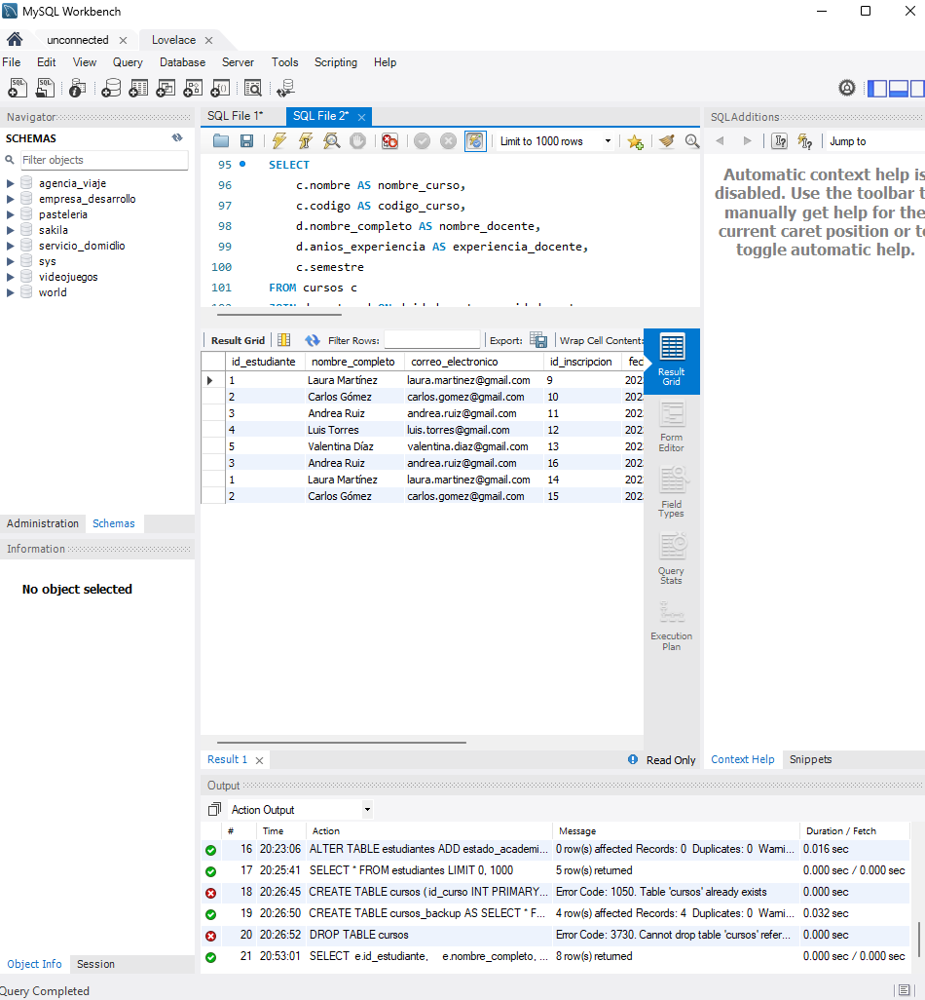
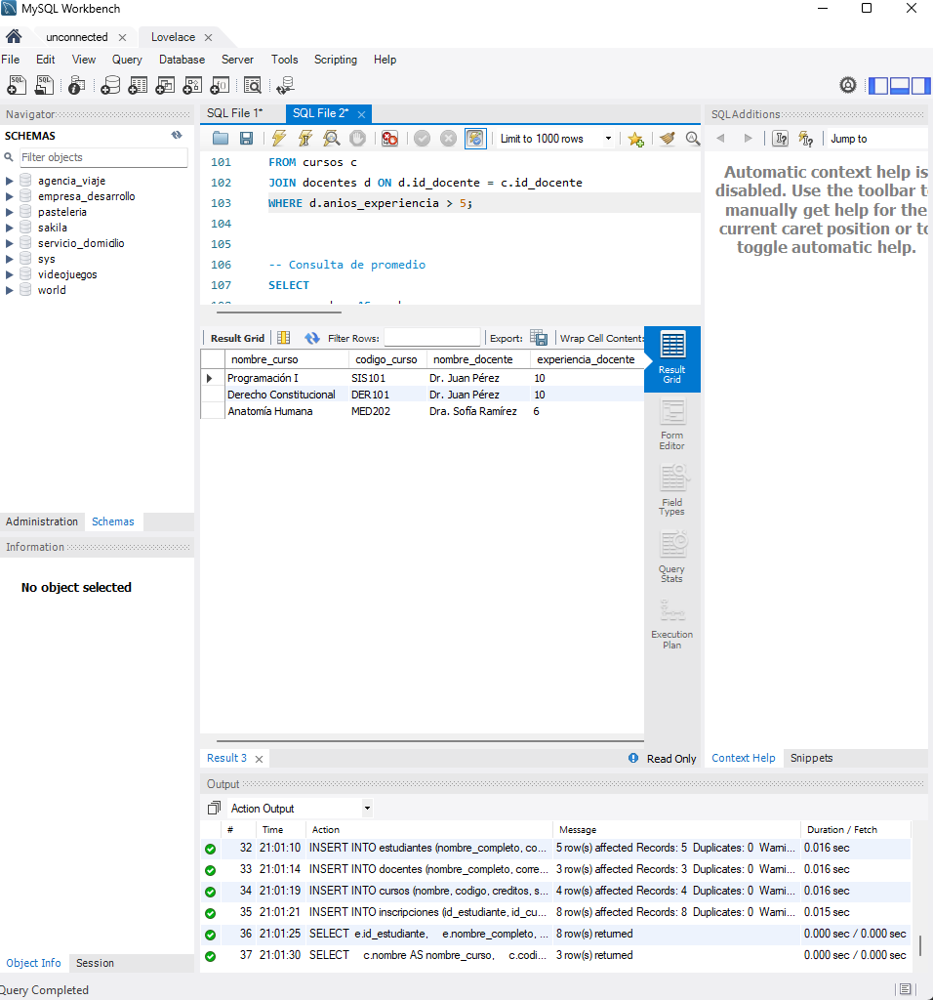
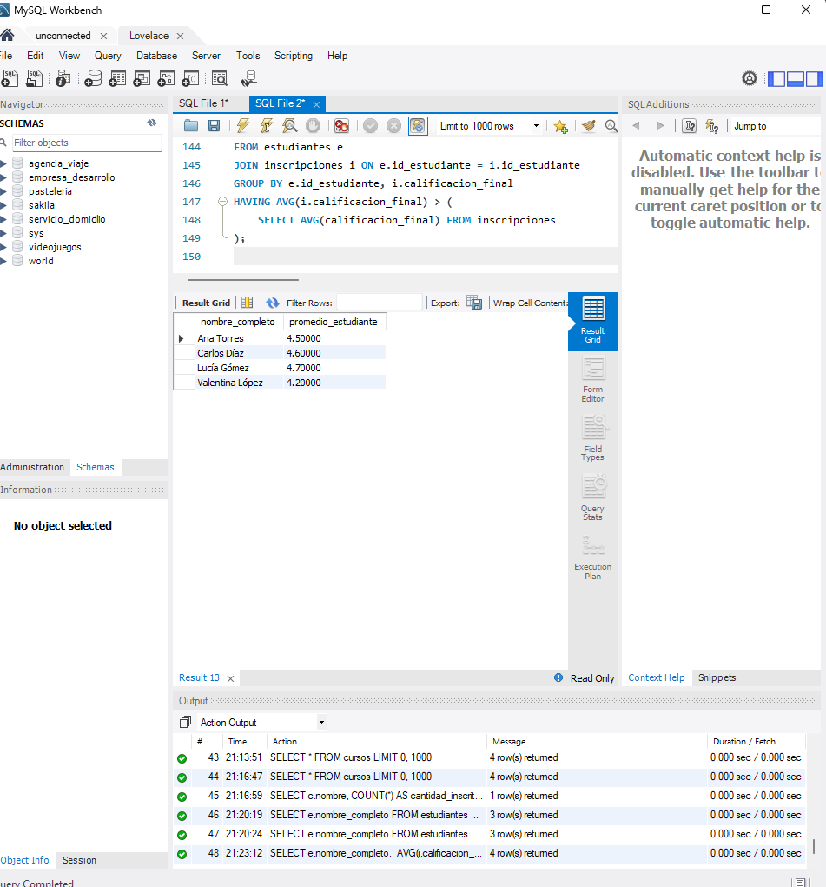
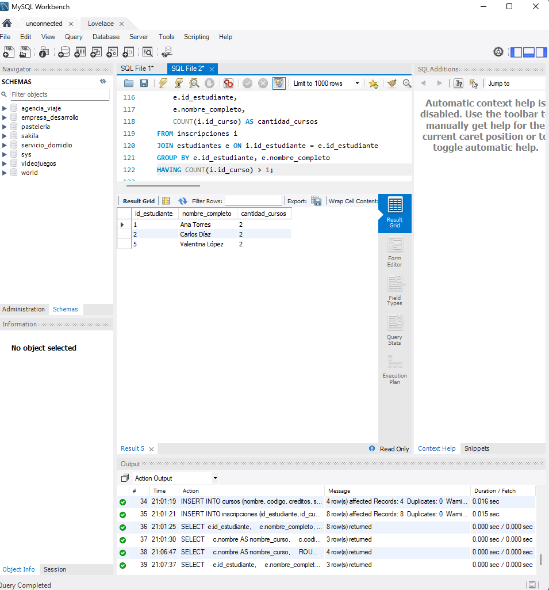
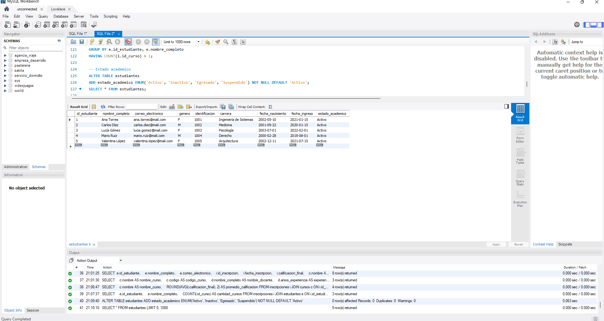
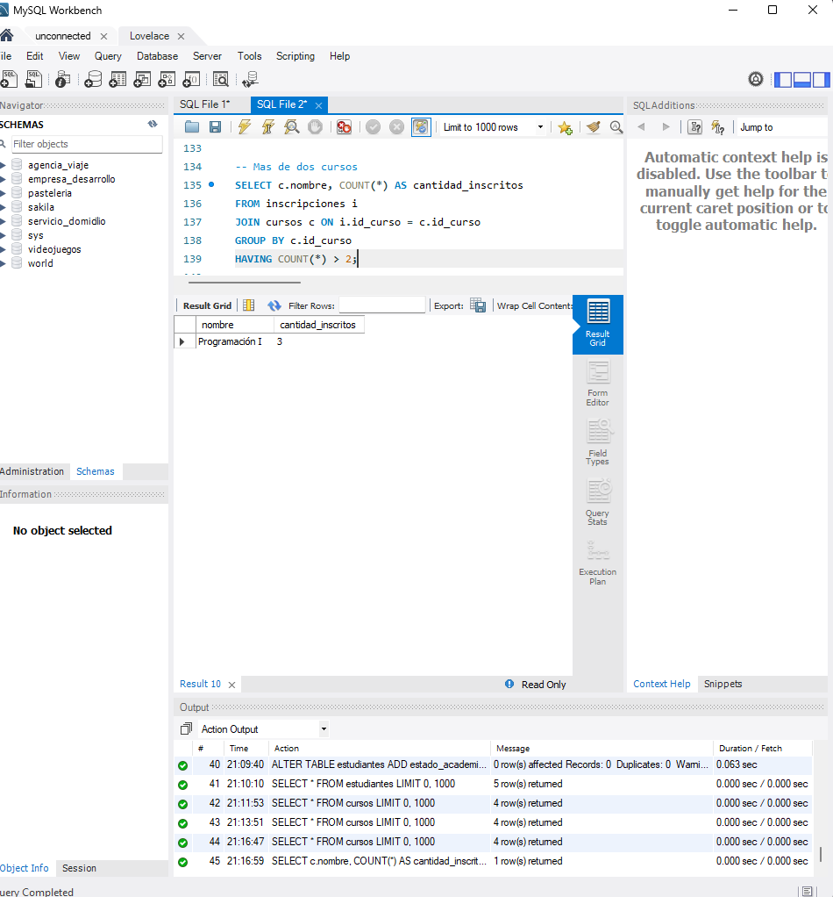

# Sistema de Gestión Académica

Este proyecto contiene un sistema básico de gestión académica usando MySQL. Incluye la creación de tablas, consultas básicas, manipulación de datos y vistas, aplicando buenas prácticas en el manejo de bases de datos relacionales.

## 📁 Base de Datos

Se crea una base de datos llamada `gestion_academica` con las siguientes tablas:

- `estudiantes`
- `docentes`
- `cursos`
- `inscripciones`

Incluye relaciones entre las entidades y restricciones como claves foráneas, `CHECK`, `NOT NULL`, y `ENUM`.

## 📌 Consultas y Manipulación de Datos

### 🔹 1. Listado de todos los estudiantes con sus inscripciones y cursos
```sql
SELECT 
    e.id_estudiante,
    e.nombre_completo,
    e.correo_electronico,
    i.id_inscripcion,
    i.fecha_inscripcion,
    i.calificacion_final,
    c.nombre AS nombre_curso,
    c.codigo AS codigo_curso,
    c.semestre
FROM estudiantes e
JOIN inscripciones i ON e.id_estudiante = i.id_estudiante
JOIN cursos c ON i.id_curso = c.id_curso;
```


---

### 🔹 2. Cursos dictados por docentes con más de 5 años de experiencia
```sql
SELECT
    c.nombre AS nombre_curso,
    c.codigo AS codigo_curso,
    d.nombre_completo AS nombre_docente,
    d.anios_experiencia AS experiencia_docente,
    c.semestre
FROM cursos c
JOIN docentes d ON d.id_docente = c.id_docente
WHERE d.anios_experiencia > 5;
```


---

### 🔹 3. Promedio de calificaciones por curso
```sql
SELECT
    c.nombre AS nombre_curso,
    ROUND(AVG(i.calificacion_final), 2) AS promedio_calificacion
FROM inscripciones i
JOIN cursos c ON i.id_curso = c.id_curso
GROUP BY c.nombre;
```


---

### 🔹 4. Estudiantes inscritos en más de un curso
```sql
SELECT
    e.id_estudiante,
    e.nombre_completo,
    COUNT(i.id_curso) AS cantidad_cursos
FROM inscripciones i
JOIN estudiantes e ON i.id_estudiante = e.id_estudiante
GROUP BY e.id_estudiante, e.nombre_completo
HAVING COUNT(i.id_curso) > 1;
```


---

### 🔹 5. Agregar columna `estado_academico` a la tabla estudiantes
```sql
ALTER TABLE estudiantes
ADD estado_academico ENUM('Activo', 'Inactivo', 'Egresado', 'Suspendido') NOT NULL DEFAULT 'Activo';

SELECT * FROM estudiantes;
```


---

### 🔹 6. Cursos con más de dos estudiantes inscritos
```sql
SELECT c.nombre, COUNT(*) AS cantidad_inscritos
FROM inscripciones i
JOIN cursos c ON i.id_curso = c.id_curso
GROUP BY c.id_curso
HAVING COUNT(*) > 2;
```


---

## 📦 Archivo SQL completo

Incluye el script con toda la estructura y datos en `Sistema academico.sql`.
